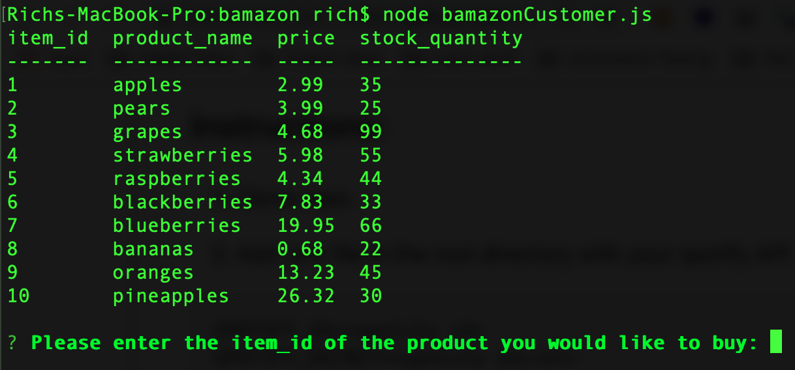
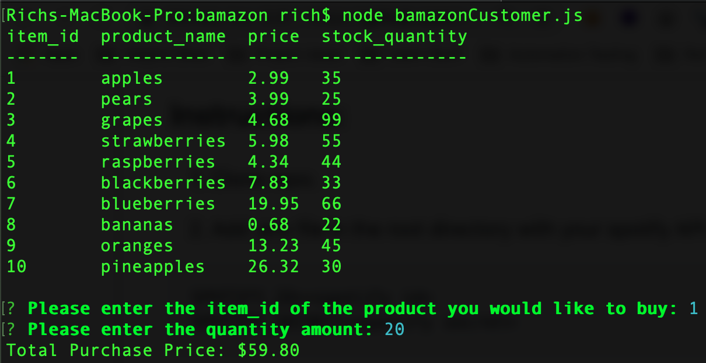
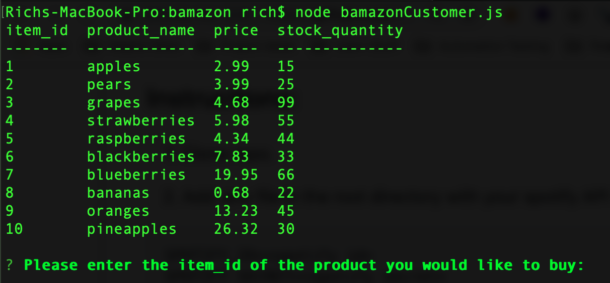
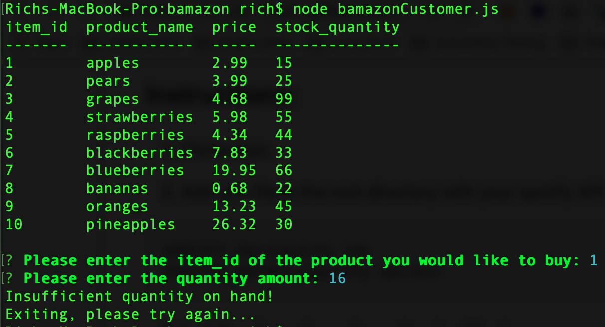

# Bamazon Node App

This is a CLI product inventory tool:

1. It stores product, price, and quantity
1. Allows to select type of product and input quantity needed
1. Calculates price of quantity user selected

## Installation Instructions:

#### Prereq:
1. node
1. MySQL database server

#### Steps:
1. Clone repo.
1. Run the bamazon-schema.sql file against your MySQL DB - this will install the basic db schema and input sample data entries.
1. Modify the database connection information in the bamazonCustomer.js file
1. Install node package dependencies (if using npm: npm install)

## Usage Instructions:
1. Run the tool with the following command:
node bamazonCustomer.js
1. Follow instructions in the application

## Additional Notes:
For a video tutorial of the application please, try the link below:
[Youtube Link to Demo Video]()

## Screenshots:

1. The initial start of the program will display all information - product, price, quantity

1. After selecting a product and quantity amount of the purchase, the program will display the total purchasing cost

1. The program will update and reflect the new change in quantity, notice the quantity change for the product "apples"

1. If the user selects a quantity more than what is in inventory, the program will notify the user and exit. Notice the user selected quantities of "apples"
